  

 

  <picture>
    <source media="(prefers-color-scheme: dark)" srcset="dark-profile.svg" />
    <source media="(prefers-color-scheme: light)" srcset="light-profile.svg" />
    
  </picture>

 

## 
🛠️ Tech Stack

  

 
  

    
  

  

  

 

  

  

